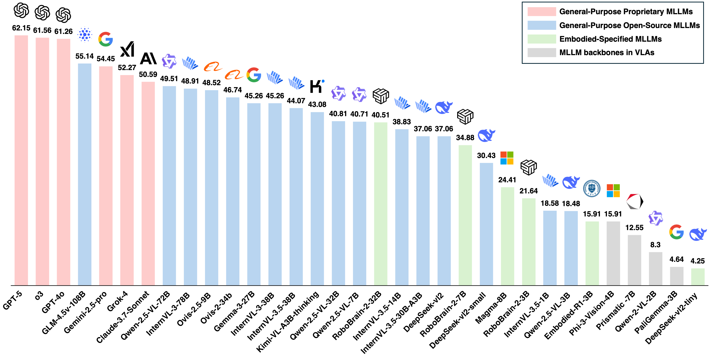

# PhysToolBench: Benchmarking Physical Tool Understanding for MLLMs

## Introduction
> **"Man is a Tool-using Animal; without tools he is nothing, with tools he is all." --Thomas Carlyle**

 
*For an Embodied Agent, using physical tools is crucial in many tasks. The understanding of physical tools significantly impacts the task's success rate and execution efficiency (Top). PhysToolBench (Bottom) systematically evaluates the understanding of physical tools of multimodal LLMs. The benchmark is designed with three progressive levels of difficulty and employs a Visual Question Answering (VQA) format. Notice that in the actual benchmark, tools in the images are numerically labeled. Images here are for illustrative purposes only.*



*MLLM Leaderboard on our PhysToolBench, ranked by overall performance.*


The ability to use, understand, and create tools is a hallmark of human intelligence, enabling sophisticated interaction with the physical world. For any general-purpose intelligent agent to achieve true versatility, it must also master these fundamental skills. While modern Multimodal Large Language Models (MLLMs) leverage their extensive common knowledge for high-level planning in embodied AI and in downstream Vision-Language-Action (VLA) models, the extent of their true understanding of physical tools remains unquantified. To bridge this gap, we present PhysToolBench, the first benchmark dedicated to evaluating the comprehension of physical tools by MLLMs. Our benchmark is structured as a Visual Question Answering (VQA) dataset comprising over 1,000 image-text pairs. It assesses capabilities across three distinct difficulty levels: 1) Tool Recognition: Requiring the recognition of a tool's primary function. 2) Tool Understanding: Testing the ability to grasp the underlying principles of a tool's operation. 3) Tool Creation: Challenging the model to fashion a new tool from surrounding objects when conventional options are unavailable. Our comprehensive evaluation of 32 MLLMs—spanning proprietary, open-source, specialized embodied, and backbones in VLAs—reveals a significant deficiency in the tool understanding. Furthermore, we provide an in-depth analysis and propose preliminary solutions.


## Set up

Environment setup:
```shell
git clone https://github.com/PhysToolBench/PhysToolBench.git
cd PhysToolBench
conda create phystoolbench
pip install -r requirements.txt
```
Download the dataset:
```shell
huggingface-cli download zhangzixin02/PhysToolBench
```


## Inference
You can run MLLMs in two ways to evaluate it on the PhysToolBench:
1. Use the API of the proprietory MLLMs:
    
    Our code will automatically choose the appropriate API interface based on the model name. 
    For example, to evaluate the gpt-5 model, you can run:
    ``` shell
    python src/inference.py --model_name gpt-5 --api_url https://xxxxxx --api_key "sk-xxxxxx" --resume # Put your own API URL and API key here
    ```
    We recommand using multiple threads to speed up the inference for proprietory models. For example, to use 8 threads, you can run:
    ``` shell
    python src/inference.py --model_name gpt-5 --api_url https://xxxxxx --api_key "sk-xxxxxx" --resume --num_threads 8
    ```
    You can modify the logic in `src/model_api.py` to support more models or use different API interfaces. Currently, OpenAI, Claude, Gemini format are supported. 
2. Deploy the Open-Source models and run them locally:

    To facilitate large-scale inference, we deployed open-source models used in our paper as servers with FastAPI so that they can be accessed via API for flexible evaluation. Note that more dependencies need to be installed for local inference. You can refer to the requirements.txt file for the dependencies, we recommand following the original repository of the MLLM you use for dependency installation.
    
    2.1. Start the server:
    ```shell
    python vlm_local/Qwen-2.5VL/qwen_2_5vl_server.py --port 8004 # deploy the qwen-2.5-vl server on port 8004, you can change the port to other available ports
    ```
    2.2. Run the local MLLM:
    ```shell
    python src/inference.py --model_name qwen-2.5-vl-7B --api_url http://localhost:8004 --api_key "" --resume # Evaluate the qwen-2.5-vl-7B model
    ```
    Since the [lmdeploy](https://github.com/InternLM/lmdeploy/blob/main/docs/en/multi_modal/api_server_vl.md) and [vllm](https://docs.vllm.ai/en/latest/getting_started/quickstart.html#openai-compatible-server) are also compatible with the OpenAi-API format, you can easily deploy other models using lmdeploy and vllm as long as they are supported by these tools.

## Evaluate
You can evaluate the results and calculate the scores with the following command:
```shell
python src/metric.py 
```

## Todo
- [ ]  Add Support to VLMEvalKit

## Acknowledgement
Our code is built upon the following repositories:
- [VGRP-Bench](https://github.com/ryf1123/VGRP-Bench)
